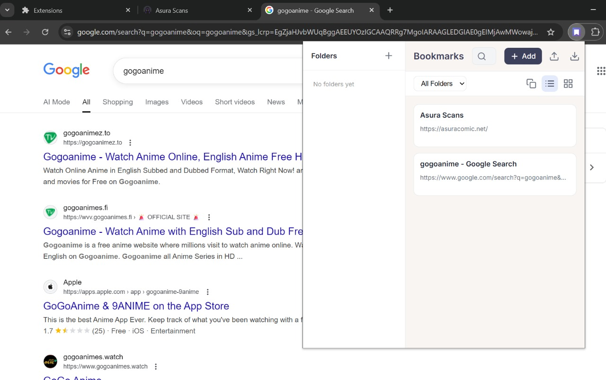
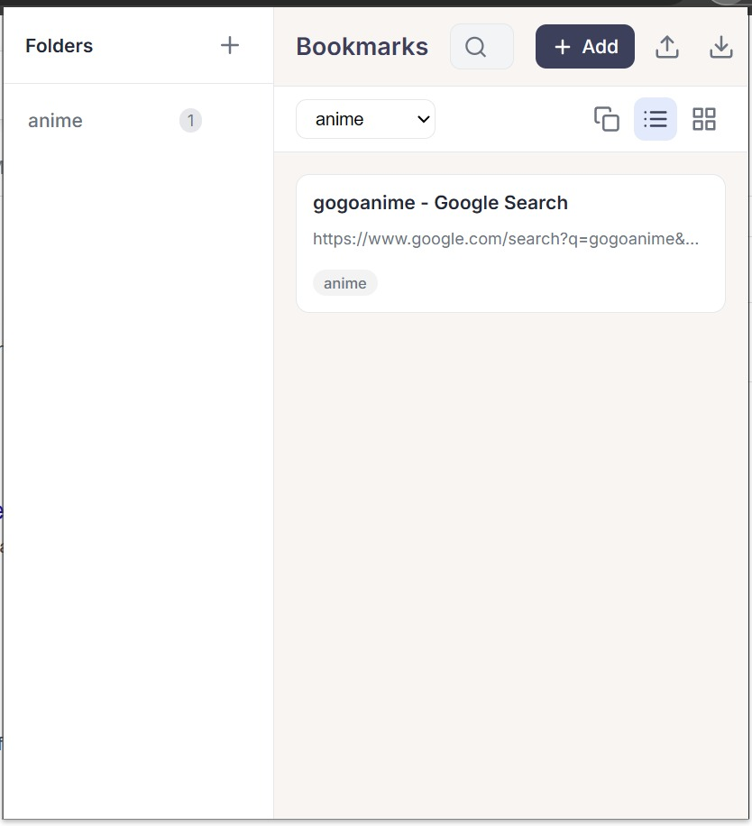
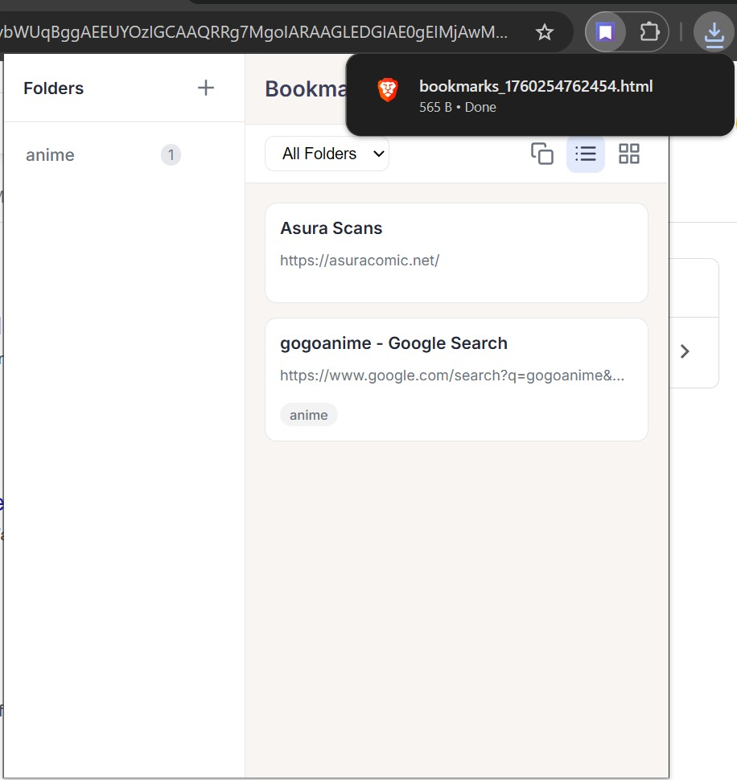

# Bookmark Manager

A browser extension that provides an intuitive and efficient way to manage bookmarks. It allows organization into folders, tagging, search, and drag-and-drop reordering, all within a clean, modern interface.

## Features

- *Folders* - Create, rename, delete, and organize bookmarks into folders.  
- *Tags* - Add tags to bookmarks for easier categorization and search.  
- *Search* - Search by title, URL, description, or tags.  
- *Drag & Drop* - Reorder bookmarks or move them between folders.  
- *Import/Export* - Import bookmarks from HTML files or export your collection.  
- *Context Menu* - Add any page or link as a bookmark directly from right-click.  
- *Bulk Operations* - Select multiple bookmarks for batch deletion.  
- *Multiple Views* - List view for details, grid view for quick browsing.  
- *Responsive Design* - Modern interface optimized for usability.

## Installation

1. Download or clone the repository.  
2. Open your browser's extensions/add-ons page.  
3. Enable developer mode (if required).  
4. Load the extension by selecting the folder with the files.  
5. The extension icon will appear in your toolbar.

## Usage

- *Add Bookmarks:* Click the "Add" button or right-click a page/link.  
- *Create Folders:* Click the "+" button in the folders sidebar.  
- *Search:* Use the search bar to filter bookmarks by title, URL, or tags.  
- *Organize:* Drag bookmarks to reorder or move them into folders.  
- *Import/Export:* Use the respective buttons to import or save bookmarks.  
- *Bulk Delete:* Enable selection mode, select bookmarks (Not the small boxes), and delete them in one action.

## Screenshots

  
Main interface showing folders, search, and bookmarks.

  
Organize bookmarks into folders with visible counts.

  
Export bookmarks as an HTML file.

## Future Improvements

- Cross-device synchronization  
- Bookmark previews (thumbnails)  
- Keyboard shortcuts  
- Duplicate detection and merge  
- Usage analytics  
- Dark mode  
- Bookmark sharing
